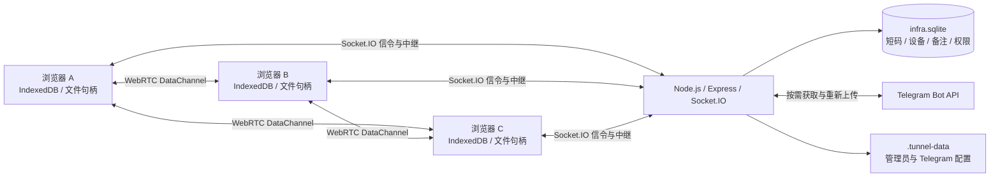
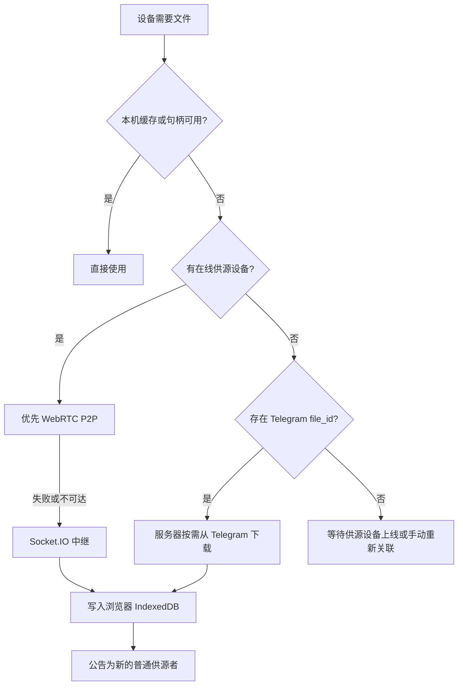

# Drop2Tunnel（即时传输隧道）

> 自托管、浏览器优先的跨设备传输与协同工作台。

Drop2Tunnel 以“隧道”为协作单元，让多台设备通过浏览器加入同一空间，发送文本、富文本、文件与合辑，并在设备之间同步缓存、协同内容和实时媒体状态。

它不是单纯的网盘，也不是纯 P2P 工具：

- Node.js 服务器负责页面托管、隧道路由、Socket.IO 信令与中继、历史协调、权限和 Telegram 接入；
- 浏览器使用 IndexedDB 保存传输记录、文件缓存和协同数据；
- 文件优先从在线设备通过 WebRTC DataChannel 获取，失败时可降级到 Socket.IO 中继；
- Telegram `file_id` 可以作为没有在线供源时的备选恢复来源；
- 已获得文件副本的浏览器会继续成为其他设备的普通供源者。

**文档基线：** `dev/2607A-NEWCODE` / `Alpha-1.6.5`

> [!WARNING]
> 项目仍处于 Alpha 阶段，适合个人、自托管和受控环境测试。当前没有应用层端到端加密，也不能把服务器视为“零接触文件数据”的可信盲中继。

## 核心概念

### 隧道

隧道是设备共享传输记录和协同状态的逻辑空间。每个隧道同时拥有：

- 内部会话 ID；
- 便于输入和分享的 5 位短码；
- 可选的隧道备注名；
- 创建者与默认权限；
- 在线设备、文件供源和历史记录状态。

用户无需注册账号，可以通过 5 位短码、二维码、完整链接或本机最近隧道列表加入。

### 传输记录

隧道中的时间线支持：

- 纯文本；
- 富文本；
- 单文件；
- 多文件合辑；
- Telegram 单文件和 album；
- 从其他隧道转发而来的记录。

传输记录保存的是消息结构和文件元信息。大文件二进制不会被塞进普通历史快照，而是通过独立的文件资产链路同步。

### 缓存副本与供源设备

每台设备独立维护本机文件缓存。某台设备拥有完整缓存或仍可读取有效的本机文件句柄时，就可以成为该文件的供源设备。

文件缺失时，恢复优先级通常为：

1. 当前设备已有的浏览器缓存或有效本机文件句柄；
2. 同隧道或关联源隧道中拥有缓存的在线设备；
3. WebRTC P2P 失败后的 Socket.IO 中继；
4. Telegram `file_id` 等已登记的备选来源。

从远端或 Telegram 恢复成功后，文件会写入当前浏览器缓存，并重新公告为可供其他设备获取的普通副本。

## 功能概览

### 隧道路由与设备连接

- 创建新隧道、输入 5 位短码加入、从本机已加入列表选择；
- 二维码和完整隧道链接；
- 自动记住最近访问的本机隧道；
- 隧道切换浮层、隧道备注和切换前传输任务提醒；
- 多设备同时在线和历史对齐；
- 服务端辅助的附近设备发现；
- 向尚未加入当前隧道的附近设备发送加入邀请；
- 已关注设备、设备主页和设备间联系入口；
- 本地设备备注，显示格式为 `备注名(原设备名)`；
- 备注仅对设置方可见，并只镜像给被备注设备作为不可见备份。

> “附近设备”是服务端辅助发现，不等同于 Bluetooth、Nearby Connections 或系统级近场发现。

### 文本、富文本与协同编辑

- 发送普通文本；
- 实时协同富文本编辑；
- 在协同内容中插入图片和文件引用；
- 将当前协同内容发送为富文本记录；
- 富文本记录直接编辑；
- 从版本 1 开始保存修改历史；
- 记录修改设备、修改时间和版本号；
- 双栏只读版本对比，以 `+` / `-` 标记行级差异；
- 服务端基于 `baseVersion` 原子校验并发修改；
- 离线草稿独立保存，重连后进行冲突处理；
- 冲突内容可手动合并，或作为关联原记录的新记录发送；
- 可选的跨设备剪贴板共享。

### 文件与合辑

- 点击选择、拖放和系统分享文件；
- 单文件发送；
- 多选文件按“合辑”发送，或拆分为多条记录；
- 合辑备注、单文件备注和 Telegram caption 统一进入文件记录备注；
- 合辑宫格、子文件切换和两级返回栈；
- 图片、视频和音频网页内预览；
- 图片和视频全屏浏览、键盘切换与移动端手势；
- 文件详情、下载、还原、释放浏览器缓存、删除；
- 生成磁链并通过内置下载页、缓存列表继续获取文件；
- 合辑“下载全部”会等待缓存后统一打包 ZIP，也可提前下载当前已就绪内容；
- 文件夹打包发送；
- 本机目录同步；
- 只读挂载本机目录或单文件；
- 从传输记录转发到其他隧道，并记住上次目标；
- 为每条记录复制可定位到指定隧道和锚点的链接；
- 单条传输记录详情浮层和 `/record/:sessionId/:messageId` 路由。

### 文件传输与恢复

- WebRTC DataChannel P2P 传输；
- P2P 不可用时自动回退到 Socket.IO 分块中继；
- 大文件支持按范围向多个在线供源设备请求；
- 供源负载选择、传输超时、重试和卡住检测；
- 小文件优先和手动强制拉取；
- 进度抽屉、队列状态和点击进度定位记录；
- 传输中断状态标记；
- 文件发送准备阶段的“发送处理中”占位与阶段进度；
- 浏览器缓存丢失后从其他在线设备恢复；
- 跨隧道备份导入和转发时重映射文件 ID，避免缓存键串线；
- 删除、退出和清缓存前保护仍被其他记录或隧道引用的文件；
- 删除记录后先更新 UI，再在空闲队列中清理孤立缓存，降低大文件数据库扫描造成的卡顿。

### 本机文件句柄

在支持 File System Access API 的安全 Chromium 环境中，大文件可以保留本机文件句柄：

- 文件可从原路径直接读取，不必长期复制完整二进制到浏览器；
- 有效句柄显示 `💾 外部文件`；
- 其他设备仍通过普通文件资产链路获取并缓存；
- 在远端副本确认前，可保留同一 `fileId` 下的安全缓存副本；
- 文件移动、删除、改名或权限失效后，界面回退到普通还原流程；
- 远端恢复成功后，会立即刷新传输记录、合辑卡片和预览层。

该能力依赖浏览器实现和用户授权，不应被视为永久可靠的文件存储。

### 会话资源管理器

资源管理器用于查看当前隧道中的文件资源及其引用关系：

- 单文件、合辑文件、富文本和协同编辑引用；
- 本机缓存、外部句柄、远端供源和 Telegram 来源状态；
- 按类型、缓存状态和 Telegram 渠道筛选；
- 跳转到引用位置；
- 挂载本机目录或文件；
- 清理未引用或中断的垃圾缓存；
- Telegram 文件防失联检测及修复；
- 桌面端居中大浮层、移动端全屏；
- 刷新、最小化、恢复和关闭；
- 最小化后保留筛选、搜索、滚动位置和已加载 DOM，并显示为可拖动悬浮胶囊。

### 备份与导入

- 导出当前隧道传输历史；
- 仅元数据备份；
- 包含文件二进制的完整备份；
- 导入时保留原时间，或追加到当前时间线尾部；
- 跨隧道导入时重映射 `fileId`；
- 如果本机已有源缓存，可复制为目标隧道的独立缓存；
- 备份文件从普通文件入口选中时，会自动识别并进入导入流程；
- 导入和退出隧道等重操作显示阻塞进度面板。

### PWA 与移动端

- 可安装为 PWA；
- Android 系统分享目标 `/share/`；
- 批量分享后可选择合辑或拆分发送；
- Service Worker 应用壳缓存和强制刷新；
- 移动端“连接 / 隧道 / 协同”三栏横向跟手切换；
- 传输记录滚动锚点保存和载入稳定；
- 文件预览、全屏、合辑和音乐播放器的浏览器返回栈；
- 系统分享和页面选择文件使用统一的发送准备进度。

### 媒体预览与音乐播放器

- 视频封面本地生成与缓存；
- MP3、M4A/MP4、FLAC 等音频封面和文字元数据解析；
- 音频临时试听；
- 全屏后台音乐播放器；
- 播放队列、拖动排序、删除、收藏、定位文件、分享和下载；
- 队尾自动从当前隧道媒体库补充不重复歌曲；
- 队列按设备和隧道持久化；
- Media Session 系统通知栏控制；
- 封面、队列顺序和当前歌曲恢复。

### 实时媒体能力

以下功能依赖 HTTPS、浏览器权限和 WebRTC，仍建议视为实验性能力：

- 全局对讲机；
- 群语音；
- 摄像头广播；
- 已关注设备之间的音视频联系。

### Telegram Bot

Telegram Bot 可作为隧道内容入口和文件恢复兜底：

- 管理页录入 Bot Token；
- 自动生成 webhook secret；
- 自动注册 webhook 和命令；
- `/tunnel 12345` 进入指定隧道中转模式；
- `/leave_tunnel` 退出中转模式；
- 未绑定模式下从 caption 或后续消息获取 5 位短码；
- 文本、富文本、文件、图片、视频、音频、语音、动画、视频消息；
- `media_group_id` 聚合为一个合辑；
- 单文件 caption 和 album caption 原样保存为记录备注；
- 中转模式和聊天绑定持久化，Node.js 重启后恢复；
- Telegram `file_id` 长期绑定在文件记录上，作为设备间恢复失败后的备选来源；
- 服务端按需下载 Telegram 文件到临时缓存，完成客户端传输后清理二进制；
- 文件恢复到浏览器后，浏览器成为普通在线供源者；
- 资源管理器可检测当前 Bot 是否仍能使用旧 `file_id`；
- 在已有本机或在线设备副本时，可通过当前 Bot 重新上传并换绑新的 `file_id`。

Telegram 不能凭空恢复已经在所有设备、服务器和旧 Bot 中都不可用的文件。

### Telegram SNS 媒体文件

当 Telegram 转入隧道的文本、单文件备注或 album caption 中包含 YouTube、YT Music、TikTok、Facebook、Instagram、Threads、LINE、Twitter/X 等链接时，服务端会先异步识别可由 `yt-dlp` 解析的 SNS 媒体：

- 备注中可同时包含多个 URL；
- 列表 URL 会作为一个可展开的来源，内部包含多条媒体；
- 识别阶段只读取元数据，不会自动下载完整媒体；
- 在“传输记录详情”底部的“SNS媒体文件”区域，点击“获取文件内容”才会启动完整下载；
- 服务端使用 `yt-dlp` 下载到 `.tunnel-data` 临时工作区，成功后注册成 server asset，并生成一条普通文件传输记录；
- 客户端继续按普通 server asset 逻辑通过 HTTP/Range 拉取到浏览器缓存；
- 已经获得缓存的浏览器会成为后续其他设备的普通供源者。

YouTube 视频下载会优先选择 H.264、最高不超过 1080p 的视频轨，并按音频码率优先选择接近 256K、再接近 128K 的 AAC/M4A 音轨；若无 H.264 视频，则降级到 AV1 或其他可用视频轨。`music.youtube.com` 链接只选择音频轨。该能力要求服务端已安装 `yt-dlp` 和 `ffmpeg`。

### 设置、权限与管理

- 功能首页顶栏齿轮设置页；
- 发送文件夹、同步目录、剪贴板共享、垃圾清理、资源浏览器和备份/导入统一放入设置页；
- 隧道创建者身份；
- 默认权限矩阵：
  - 读取传输记录；
  - 发送文本；
  - 发送富文本；
  - 发送文件；
  - 删除记录；
  - 协同编辑；
  - 全局对讲机发声；
  - 群语音；
- 权限同时在客户端 UI 和服务端事件处理层执行；
- 无读取权限的设备不会收到历史快照、实时记录或历史广播；
- `/admin` 管理后台；
- `/tgbot` Telegram 配置页；
- 首次使用 TOTP 配置和管理员会话 Cookie；
- 管理认证、敏感 API 和 Telegram 配置受到服务端保护。

当前权限模型以“创建者配置普通加入设备的默认权限”为主，尚未完成多管理员和逐设备权限分配。

## 架构



### 文件恢复流程



## 数据存储与隐私边界

| 数据 | 主要位置 | 说明 |
| --- | --- | --- |
| 传输记录、文件缓存、协同内容 | 浏览器 IndexedDB | 每台设备独立保存，可被浏览器配额策略清理 |
| PWA 系统分享待发送文件 | 浏览器 IndexedDB `shareQueue` | 页面打开后转入正常发送流程 |
| 本机目录和文件句柄 | 浏览器 IndexedDB | 依赖 File System Access API 和持续授权 |
| 活跃隧道、Socket 状态、供源索引 | Node.js 内存 | 服务重启后由浏览器重新加入并协调恢复 |
| 隧道短码、备注、创建者、权限、设备访问元数据 | `.tunnel-data/infra.sqlite` | 使用 `sql.js` 持久化 |
| 管理员 TOTP 和会话签名密钥 | `.tunnel-data` | 本机私有文件，需妥善备份和限制权限 |
| Telegram Bot 配置与聊天绑定 | `.tunnel-data` | Token 不写入 `tunnel.config.json` |
| Telegram 文件临时缓存和 `file_id` 元数据 | `.tunnel-data/telegram-assets` | 二进制按需下载并尽量在客户端取走后清理 |
| SNS Cookies | `.tunnel-data/*-cookies.txt` | 由 `/sns-cookies` 管理，用于 `yt-dlp` 访问 YouTube、TikTok、X 等平台 |
| SNS 媒体临时下载 | `.tunnel-data/sns-media-work` | `yt-dlp` 下载过程中的临时输出，成功后登记为 server asset |
| Socket.IO 中继数据 | 服务器进程 | 中继期间服务器会接触文件分块 |

因此：

- 项目不是“服务器绝不接触文件内容”的架构；
- WebRTC 成功时文件可直接在浏览器之间传输；
- Socket.IO 降级和 Telegram 恢复时，服务器会处理中转或临时文件数据；
- 当前没有额外的应用层端到端加密；
- 隧道短码应当作为敏感访问信息对待。

## 快速开始

### 环境要求

- Node.js 18 或更高版本；
- npm；
- `yt-dlp`，用于解析和按需下载 Telegram 备注中的 SNS 媒体链接；
- `ffmpeg`，用于 `yt-dlp` 合并视频轨/音频轨、转封装和处理部分平台媒体；
- 支持 WebSocket、WebRTC 和 IndexedDB 的现代浏览器；
- PWA、文件句柄、摄像头和麦克风等完整能力需要 HTTPS，`localhost` 除外。

### 获取代码

```bash
git clone https://github.com/Ltre/file-tunnel.git
cd file-tunnel
git checkout dev/2607A-NEWCODE
npm ci
```

### 配置端口

项目读取根目录的 `tunnel.config.json`：

```json
{
  "debugLogsEnabled": false,
  "serverPort": 3000
}
```

仓库当前配置默认使用 `80` 端口。Linux 普通用户通常不能直接监听低于 1024 的端口，开发和反向代理部署建议改为 `3000` 或其他高位端口。

### 启动

```bash
npm start
```

然后访问：

```text
http://localhost:3000
```

局域网测试可使用：

```text
http://<服务器局域网 IP>:3000
```

局域网 IP 上的普通 HTTP 不属于安全上下文，File System Access、摄像头、麦克风、部分 PWA 能力可能不可用。完整功能请使用 HTTPS 域名。

### 限制允许的来源

默认允许任意 Origin。生产环境建议设置：

```bash
ALLOWED_ORIGINS=https://tunnel.example.com npm start
```

多个来源使用逗号分隔：

```bash
ALLOWED_ORIGINS=https://a.example.com,https://b.example.com npm start
```

## 生产环境反向代理

以下是一个最小 Nginx 示例。证书部分请按实际环境配置：

```nginx
map $http_upgrade $connection_upgrade {
    default upgrade;
    ''      close;
}

server {
    listen 443 ssl http2;
    server_name tunnel.example.com;

    # ssl_certificate ...;
    # ssl_certificate_key ...;

    location / {
        proxy_pass http://127.0.0.1:3000;
        proxy_http_version 1.1;
        proxy_set_header Upgrade $http_upgrade;
        proxy_set_header Connection $connection_upgrade;
        proxy_set_header Host $host;
        proxy_set_header X-Real-IP $remote_addr;
        proxy_set_header X-Forwarded-For $proxy_add_x_forwarded_for;
        proxy_set_header X-Forwarded-Proto $scheme;
        proxy_read_timeout 300s;
        proxy_send_timeout 300s;
    }
}
```

代理层必须正确转发 WebSocket Upgrade 请求，否则 Socket.IO、传输信令和实时协同无法正常工作。

## PWA 配置

`manifest.hosts.json` 支持按访问域名返回不同的 PWA 名称、图标、主题色和 Share Target 配置。

最小结构：

```json
{
  "default": {
    "name": "Drop2Tunnel",
    "short_name": "Drop2Tunnel",
    "description": "在同一个传输隧道中的设备间发送文件、消息和协同内容。",
    "start_url": "/?pwa=1",
    "scope": "/",
    "display": "standalone",
    "background_color": "#f4f6fb",
    "theme_color": "#4f5ec2",
    "icons": [
      {
        "src": "/tunnel-icon.svg",
        "sizes": "any",
        "type": "image/svg+xml",
        "purpose": "any maskable"
      }
    ],
    "share_target": {
      "action": "/share/",
      "method": "POST",
      "enctype": "multipart/form-data",
      "params": {
        "title": "title",
        "text": "text",
        "url": "url",
        "files": [
          {
            "name": "shared_file",
            "accept": ["*/*"]
          }
        ]
      }
    }
  }
}
```

修改 Service Worker 应用壳资源后，也要同步更新 `CACHE_NAME`，避免旧 PWA 长期使用缓存版本。

## 管理后台

打开：

```text
https://tunnel.example.com/admin
```

首次访问会进入管理员 TOTP 初始化流程：

1. 使用身份验证器扫描二维码或录入密钥；
2. 输入 6 位动态验证码完成初始化；
3. 浏览器获得受 `HttpOnly`、`SameSite=Strict` 保护的管理员会话 Cookie；
4. 后续可进入管理后台和 Telegram 配置页。

管理员认证文件位于 `.tunnel-data`。迁移服务器时应一并备份，否则需要重新初始化认证。

## Telegram Bot 配置

完成管理员登录后打开：

```text
https://tunnel.example.com/tgbot
```

配置项包括：

- Bot Token；
- Telegram 最大文件大小；
- 用于 `file_id` 换绑修复的私有用户、群组或频道 ID。

保存后，服务端会验证 Token、生成 webhook secret、注册 webhook，并注册 `/tunnel` 与 `/leave_tunnel` 命令。

使用示例：

```text
/tunnel A1B2C
```

进入中转模式后，发送到 Bot 的内容会直接进入该隧道。退出：

```text
/leave_tunnel
```

Telegram webhook 必须能够从公网通过 HTTPS 访问当前服务。

## SNS Cookies 配置

完成管理员登录后打开：

```text
https://tunnel.example.com/sns-cookies
```

可为 YouTube / YT Music、TikTok、Facebook、Instagram、Threads、LINE、Twitter/X 等平台保存 cookies 文件内容。YouTube 和 YT Music 共用 `.tunnel-data/yt-cookies.txt`。

这些 cookies 只供服务端 `yt-dlp` 在识别和下载 SNS 媒体时使用。它们可能包含敏感登录态，应像 Bot Token 一样保护，不要提交到 Git 仓库，也不要交给不可信用户。

如果 YouTube 出现 JS challenge 相关警告，服务端默认会为 YouTube / YT Music 调用 `yt-dlp --remote-components ejs:github`。可通过环境变量 `SOCIAL_YTDLP_REMOTE_COMPONENTS=false` 禁用，或设置为其他值覆盖默认来源。

## 音视频 ICE 配置

`tunnel.config.json` 中可为实时音视频功能追加 ICE/TURN 配置：

```json
{
  "serverPort": 3000,
  "debugLogsEnabled": false,
  "rtc": {
    "replaceDefaultIceServers": false,
    "iceServers": [
      { "urls": "stun:stun.example.com:3478" }
    ],
    "turnServers": [
      {
        "urls": "turn:turn.example.com:3478",
        "username": "user",
        "credential": "password"
      }
    ]
  }
}
```

该运行时配置目前主要由实时音视频控制器使用。普通文件 DataChannel 仍包含项目内置的公共 STUN 配置。

## 基本使用流程

1. 打开首页，创建新隧道或输入 5 位短码加入；
2. 为当前设备设置易识别的名称；
3. 通过二维码、短码或链接让其他设备加入；
4. 发送文本、富文本、单文件或合辑；
5. 在其他设备点击“还原文件”获取缺失缓存；
6. 使用“释放空间”仅删除当前浏览器中的缓存副本，不删除隧道记录；
7. 使用资源管理器检查引用、缓存来源和 Telegram 兜底状态；
8. 使用备份/导入保存或迁移传输历史；
9. 使用“暂时离开”保留本机隧道数据，使用“退出隧道”清理当前设备中的该隧道数据。

## 浏览器兼容性

推荐使用当前版本的 Chrome、Edge 或其他 Chromium 浏览器。

| 能力 | Chromium | Firefox | Safari / iOS |
| --- | --- | --- | --- |
| 文本、历史、IndexedDB | 推荐 | 基础可用 | 基础可用 |
| WebRTC 文件与音视频 | 推荐 | 视环境而定 | 受系统策略影响较大 |
| PWA 安装 | 推荐 | 平台相关 | 支持方式与限制不同 |
| Web Share Target | Android Chromium 推荐 | 通常不可用 | 支持情况不同 |
| File System Access 句柄 | 推荐，需 HTTPS | 不支持或能力有限 | 不支持或能力有限 |
| 后台媒体与 Media Session | 推荐 | 部分支持 | 受系统限制 |

实际兼容性还取决于系统权限、浏览器后台策略、NAT、防火墙和反向代理配置。

## 当前限制

- 项目仍处于 Alpha 阶段，数据结构和交互可能继续调整；
- 没有应用层端到端加密；
- Socket.IO 中继时服务器能够接触文件分块；
- 尚未实现把已接收分片持久化后跨刷新继续的完整断点续传；
- 页面刷新、网络中断或切换隧道会中止当前活动传输；
- IndexedDB 容量和清理策略由浏览器决定，大文件缓存可能被系统回收；
- File System Access 句柄可能因移动、删除、重命名或撤销权限而失效；
- “30MB 以下文件不使用外部句柄”的策略在部分移动端批量或合辑场景仍有重复授权提示的回归记录；
- Telegram `file_id` 与 Bot 相关，换 Bot 后必须在仍有文件内容来源时重新上传换绑；
- 没有任何浏览器缓存、在线设备副本或可用 Telegram 来源时，文件无法被恢复；
- 当前隧道权限主要是创建者配置的全局默认权限，尚未提供完整的多管理员和逐设备权限矩阵；
- 富文本版本编辑器尚未完全复用协同编辑器的全部内容插入能力；
- 当前界面以简体中文为主，完整多语言支持尚未实现。

## 当前默认限制

以下数值来自当前服务端实现，后续版本可能调整：

- 单个隧道最多 10 台在线设备；
- 服务端历史协调窗口最多 1000 条记录；
- 单个隧道最多登记 500 个文件资产；
- 单个文件资产最大 1 GiB；
- 富文本协同内容最大约 512 KiB；
- 单个编辑器资源最大 20 MiB。

这些限制不等同于浏览器实际可用存储空间；浏览器配额通常会更早成为大文件缓存的约束。

## 目录结构

```text
file-tunnel/
├── pages/
│   ├── index.html                     # 主应用页面和响应式 UI
│   ├── admin.html                     # 管理后台
│   ├── admin-auth.html                # 管理员 TOTP 初始化与登录
│   ├── tgbot.html                     # Telegram Bot 配置页
│   ├── sns-cookies.html               # SNS cookies 配置页
│   ├── device.html                    # 设备主页
│   ├── downloader.html                # 磁链下载页
│   └── downloadList.html              # 磁链缓存列表
├── app.js                             # 隧道、消息、缓存、预览、设置与交互主逻辑
├── server.js                          # Express、Socket.IO、隧道、Telegram 和管理 API
├── service-worker.js                  # PWA 应用壳与 Share Target
├── tunnel.config.json                 # 服务端端口、调试和 RTC 运行配置
├── manifest.hosts.json                # 按域名生成 PWA Manifest
├── client/
│   ├── file-assets.js                 # 文件请求、P2P、Relay、多源和重试
│   ├── folder-archive.js              # 文件夹打包与目录相关逻辑
│   ├── media.js                       # 对讲机、语音、摄像头和设备通话
│   └── qrcode-1.0.0.min.js            # 二维码生成
├── server/
│   ├── file-assets.js                 # 文件供源索引和 Socket.IO 中继
│   ├── media-session.js               # 实时媒体信令
│   ├── infra-store.js                 # SQLite 基础设施元数据
│   └── admin-auth.js                  # 管理员 TOTP 与会话认证
├── tools/deploy/                      # 静态资源压缩、发布包生成、远端同步和回滚脚本
├── docs/devlog/                       # 按开发阶段整理的实现记录
├── prompts/dev-prompt-logs/           # 需求、排查过程和 Codex 处理记录
└── .tunnel-data/                      # 运行后生成的服务端持久化数据
```

## 构建与发布工具

仓库提供 `tools/deploy` 下的最小可控部署工具：

- `npm run deploy:build`：生成压缩后的前端静态资源和服务端发布目录；
- `npm run deploy:verify`：检查发布目录中的关键文件；
- `tools/deploy/release.sh <profile>`：按 `tools/deploy/profiles/*.json` 生成对应环境的 `dist`；
- `tools/deploy/deploy-remote.sh <profile>`：使用 rsync 将 `dist` 同步到目标服务器，默认不删除目标目录中 dist 没有的额外文件；
- `tools/deploy/rollback.sh`：辅助回滚。

详细说明见 [`tools/deploy/README.zh-cn.md`](tools/deploy/README.zh-cn.md)。

## 开发记录

项目的重要设计决策、问题复现和修复过程保存在仓库内：

- [`docs/devlog/dev-2606C-features.md`](docs/devlog/dev-2606C-features.md)：历史窗口、合辑、缓存恢复、预览与 Telegram 初期接入；
- [`docs/devlog/dev-2607A-features.md`](docs/devlog/dev-2607A-features.md)：移动端、音乐播放器、备份、文件句柄、转发、Telegram 可靠性、资源管理器、富文本版本和权限；
- [`prompts/dev-prompt-logs/dev-2607A.md`](prompts/dev-prompt-logs/dev-2607A.md)：本轮需求、测试反馈、根因排查与解决记录；
- [`prompts/dev-prompt-logs/dev-filecache-ref-260705.md`](prompts/dev-prompt-logs/dev-filecache-ref-260705.md)：跨隧道缓存引用和备份导入隔离；
- [`prompts/dev-prompt-logs/dev-real-filesystem-handle-260705.md`](prompts/dev-prompt-logs/dev-real-filesystem-handle-260705.md)：文件系统句柄与安全缓存副本；
- [`prompts/dev-prompt-logs/dev-telegram-fileid-renew-260706.md`](prompts/dev-prompt-logs/dev-telegram-fileid-renew-260706.md)：Telegram `file_id` 防失联检测与换绑。
- [`prompts/dev-prompt-logs/deploy-tools-260709.md`](prompts/dev-prompt-logs/deploy-tools-260709.md)：前端资源压缩、版本参数、PWA 缓存和部署工具设计；
- [`prompts/dev-prompt-logs/dev-260710-sns-file-dl.md`](prompts/dev-prompt-logs/dev-260710-sns-file-dl.md)：Telegram 备注中的 SNS 多链接、列表媒体识别和“获取文件内容”链路。

查看各版本的实际差异，请结合 Git 标签、Release 页面和 commit message，不要仅根据旧 README 判断当前能力。

## 服务端数据备份

至少备份：

```text
.tunnel-data/
tunnel.config.json
manifest.hosts.json
```

其中 `.tunnel-data` 包含基础设施数据库、管理员认证、Telegram 配置、SNS cookies、Telegram/SNS 临时资产和恢复元数据。

浏览器 IndexedDB 不包含在服务器备份中。重要传输记录和文件应使用应用内“备份/导入”另行导出，不能只备份服务器目录。

## 安全建议

- 生产环境必须启用 HTTPS；
- 设置明确的 `ALLOWED_ORIGINS`，不要长期保留 `*`；
- 保护 `.tunnel-data`，避免泄露 Bot Token、TOTP 和会话签名密钥；
- 不要公开传播隧道短码和完整隧道链接；
- Telegram Bot 使用专用账号、私有群组或频道作为备份目标；
- SNS cookies 可能包含第三方平台登录态，应限制文件权限并定期轮换；
- SNS 媒体下载依赖第三方平台规则和 `yt-dlp` 能力，部署者应自行确认合规边界；
- 为公网服务配置防火墙、反向代理限速和日志轮转；
- 不要把本项目用于需要强合规、零知识存储或已审计端到端加密的场景。

## 许可证

项目当前在 `package.json` 中声明为 MIT。仓库尚未提供独立的 `LICENSE` 文件，正式对外分发前建议补充完整许可证文本。
