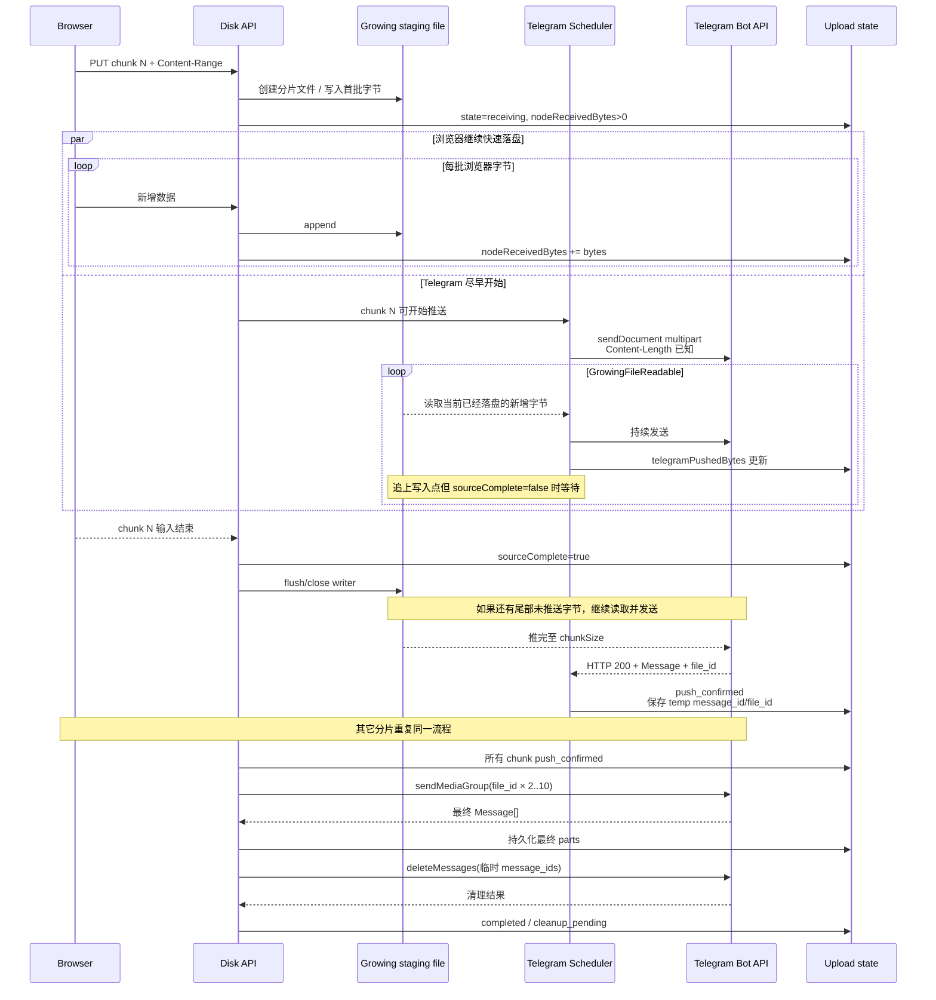

# Telegram 网盘上传分片策略重构指南

## 执行摘要

本次核验结论是：**最终讨论确定的“Node 落盘解耦 + 增长文件流式推送 Telegram”方案在技术上可行，且与当前仓库的 Node/Undici 上传方式兼容，但 Telegram Bot API 并不存在一个专门的“可续传流式上传协议”**。正确实现方式是：仍然调用标准 `sendDocument` 的 `multipart/form-data`，在请求开始时利用已知的分片大小计算完整 `Content-Length`，然后让 multipart 中的文件部分由一个可等待后续数据的 `GrowingFileReadable` 持续产出。Telegram 看到的是一条普通、完整、长度已知但逐步到达的 HTTP multipart 请求。官方 Bot API 明确支持 multipart 文件上传；Node/Undici 也明确支持 `Async Iterable`/流式 request body，而 Telegram 本地 Bot API 官方仓库的历史 issue 进一步证明服务端确实是逐步消费 multipart 数据的——过去甚至出现过“发送方较慢时，chunked Transfer-Encoding multipart 挂起”的 bug，并已在 Bot API 5.3.2 修复。因此，本项目应**优先使用已知 `Content-Length`，不要依赖 HTTP `Transfer-Encoding: chunked`**。citeturn0search1turn3search0turn2search4

本次已静态核验仓库分支 `dev/2609-s4-disksqlite+s3api-proxy-BUG`，基线 commit 为 `541af040d1381798bfc3c284d674daec4c48d4ce`，提交时间为 2026-10-02 18:58:22 UTC。该提交本身正处于“上传连续进度、Telegram 确认、失败等待”等逻辑的修复阶段，并注明已有 169 项相关回归通过；本次研究**没有在本环境独立执行这 169 项测试，因此这是静态代码核验，不是实机回归确认**。fileciteturn2file0

当前代码距离目标方案其实不远：浏览器上传已经按 20,000,000 字节规划分片；服务器已经能连续统计 Browser → Node 的接收字节；Telegram multipart 已经使用 `Readable + fetch(..., duplex:'half') + Content-Length`；甚至 `server/disk-part-cache.js` 中已经存在一套几乎可直接参考的“文件一边增长、reader 一边等增量继续读取”的实现。真正需要改变的是：**现在 `receivePart()` 必须等整个浏览器分片落盘后才把 chunk 放进 Telegram 队列，而且 `disk-api.js` 还会故意等第二个分片，最多两片一起发 Telegram。** fileciteturn12file0 fileciteturn10file0 fileciteturn8file0

建议最终采用以下语义：浏览器一开始上传分片，Node 就立即建立该分片的暂存文件，并启动一个独立 Telegram `sendDocument`；Telegram reader 只读取**已经落盘**的数据，追上写入点后等待后续增量，不向浏览器传播 Telegram backpressure。浏览器完成该分片后，Node 标记 `sourceComplete=true`，Telegram reader 再把尚未推送的尾部全部读完；只有同时达到 `nodeReceivedBytes == chunkSize`、`telegramPushedBytes == chunkSize`，并且 Telegram API 成功返回 `Message.document.file_id`，该分片才进入 `push_confirmed`。随后全部分片的 `file_id` 按顺序用 `sendMediaGroup` 重新组成最终媒体组，全部最终媒体组成功后再清除前面的分片消息。这个方案完整延续了此前讨论中已经确定的进度语义、状态文案和“不要让 Telegram 反压浏览器”的要求。fileciteturn0file0

## 背景、目标与方案取舍

当前用户侧的问题有两个层面。第一，上传进度虽然最新代码已经开始按实际连接发送字节统计，但 Browser → Node 与 Node → Telegram 的流水线仍受“分片完成/批次完成”边界影响，用户无法看到理想中的两个连续进度同时推进。第二，Telegram 真正开始处理第一个分片的时间仍太晚：当前 `telegram-drive.js` 的 `receivePart()` 会先把整个分片写入 staging，校验大小并计算 SHA-256，然后才 `file.chunks.push(... status:'queued')`；也就是说，Telegram 根本看不到正在接收的 chunk。fileciteturn12file0

当前 `disk-api.js` 的 pipeline 又进一步把 queued chunk 组合为**最多两个分片**的 batch；如果当前只有一个分片且浏览器还没有 `clientDone`，代码还会等待约 350ms，希望第二片赶上，再重新检查 batch。这正是此前“两个分片都上传到 Node 后才开始 Telegram”的观感来源之一。fileciteturn10file0

本轮最终需求已经明确为：两个摘要进度中的 numerator 都表示**正在持续流动的有效文件字节**；不需要把“服务器已确认多少”和“Telegram 已确认多少”另外堆到用户界面；用户侧也不要暴露“临时推送”这样的内部实现词，只显示“正在推送 / 推送已确认 / 推送失败 / 正在重试”。fileciteturn0file0

方案取舍可以压缩为：

| 方案 | 结论 | 原因 |
|---|---|---|
| 整个文件传完 Node 后再上传 Telegram | 放弃 | 两段无法形成有效流水线 |
| 两个分片都完整落盘后合并上传 Telegram | 放弃 | Telegram 启动太晚，且耦合“两片一组” |
| 第一片临时发送，第二片到达后用 `file_id + 新文件` 组成 album | 放弃 | 状态复杂，仍要等待下一片，奇数尾片特殊 |
| Browser request 直接 `pipe()` Telegram request | 放弃 | Telegram 慢会通过 Node stream backpressure 把浏览器拖慢 |
| 每片完整落盘后立即单独推 Telegram | 可作为降级路径 | 简单可靠，但仍损失一个完整分片的启动延迟 |
| **增长临时文件 + 独立 Telegram reader** | **正式方案** | Telegram 可尽早开工，同时 Node 磁盘隔离两端速度和失败域 |
| 全部分片先取得 `file_id`，最终以 `file_id` 重组 media group | **正式方案** | 最终组装不重新上传文件正文，结构清晰、恢复容易 |

这里有一个非常重要的概念边界：**这不是 Telegram 提供了“append chunk”的上传 API。** Bot API 官方只定义了普通 multipart 上传；本项目是在 Node 客户端侧让一个 multipart 文件 part 的 Readable 延迟 EOF，从而在同一个 HTTP 请求中持续提供新增字节。Bot API 本身没有“先提交 5MB，以后继续 append 到同一个 Bot API 文件”的方法。citeturn0search1turn1view1

## Telegram 外部限制与仓库现状

**外部限制核验**

| 项目 | 已核实限制 | 对本方案的影响 |
|---|---|---|
| 官方云 Bot API 新文件上传 | `multipart/form-data` 普通文件当前最高 **50 MB/文件** | 当前 20,000,000 字节分片安全，不建议本次顺便增大 |
| 官方云 Bot API `getFile` | FAQ 当前仍写明下载最高 20 MB | 当前项目使用 20,000,000 十进制字节作为分片上限有现实意义 |
| `sendMediaGroup` | **2–10 项** | 最终 `file_id` 列表必须拆为 2～10 项一组，不可留下单项尾组 |
| `file_id` 重用 | Telegram 明确称通过 `file_id` 重发无需重新上传，且 “There are no limits for files sent this way” | 最终 media group 不需要再次传几十/几百 MB正文 |
| `file_id` 作用域 | `file_id` 是**单个 bot 专属**，不能跨 bot；同一个文件对同一 bot 也可能存在多个有效 `file_id` | 最终 media group 返回的新 Message 应重新作为最终权威记录 |
| 单 chat 消息频率 | 官方 FAQ 建议不要长期超过约 **1 message/s**；短 burst 可能允许，最终会 429 | 每片临时消息 + 最终 album 会放大消息数，必须有调度器 |
| 429 | Bot API `ResponseParameters.retry_after` 明确给出应等待秒数 | 优先服从 `retry_after`，再叠加 jitter |
| 临时消息删除 | 普通消息原则上只能在发送后 **48h 内**删除；`deleteMessages` 一次 1–100 个 ID | 清理不能无限拖延；崩溃恢复需优先处理旧临时消息 |
| Local Bot API | `--local` 模式可上传至 **2000 MB**、不限大小下载、支持本地路径 | 是能力增强，不应改变通用 20 MB 分片格式 |
| HTTP streaming | 官方 Bot API定义 multipart；Local Bot API 官方 issue 证实曾处理慢速 chunked multipart，并在 5.3.2 修复相关 bug | 可流式提供 body，但项目应坚持已知 `Content-Length`，不主动依赖 chunked TE |

上述限制分别来自 Telegram 官方 Bot API、FAQ 和官方 `tdlib/telegram-bot-api` 仓库。citeturn0search0turn1view0turn1view1turn1view3turn5view0turn1view4turn2search0turn0search2turn2search4

尤其需要纠正一个容易混淆的点：项目目前的 `MAX_TELEGRAM_BATCH_SIZE = 40_000_000` 是**项目自己的 multipart 批次保护上限**，注释明确是为了给云端/代理请求限制和 multipart overhead 留余量，并非 Telegram 官方规定“media group 所有文件总共只能 40MB”。项目同时把单 part 固定为 `20_000_000`。fileciteturn13file0

因此，在新的最终组装阶段：

```text
sendMediaGroup([
  { type: "document", media: fileId1 },
  { type: "document", media: fileId2 },
  ...
])
```

传输的是 JSON 中的 `file_id`，而不是再次上传这些分片正文。此时原来的 40MB multipart body 安全阈值已经不是最终 album 的正文大小限制；真正需要遵守的是 **2–10 项**和消息频率限制。Telegram 官方明确允许 `InputMediaDocument.media` 使用已有 `file_id`，并明确说明通过 `file_id` 重发不重新上传文件。citeturn1view0turn1view1

对于 1、11、21 等数量，要避免产生单项 media group。建议统一分组：

```text
1  → 原分片消息直接作为最终消息
2  → 2
10 → 10
11 → 9 + 2
12 → 10 + 2
20 → 10 + 10
21 → 10 + 9 + 2
```

也可以写一个通用 partition 函数，只保证每组处于 `[2,10]`。这是由官方 2–10 项约束推导出的实现规则。citeturn1view0

**仓库关键模块**

| 文件/模块 | 当前职责与核验结果 | 是否修改 |
|---|---|---|
| `server/telegram-drive.js` | Browser → Node staging、20MB part 接收、SHA-256、upload manifest、重启 recovery；当前**整个 part 收完后才创建 queued chunk** | **必须，大改** |
| `server/disk-api.js` | 上传 HTTP route、pipeline、backpressure、Telegram queue、operation 更新；当前每个逻辑文件最多两片组成一个 pipeline batch，只有一片时会等待下一片 | **必须，大改** |
| `server/disk-telegram.js` | `sendDocument/sendMediaGroup`、file_id reuse、429、失败回滚、删除消息、Telegram 进度 | **必须，大改但保留现有错误处理** |
| `server/telegram-multipart.js` | 计算 multipart `Content-Length`，用 `Readable.from(generate())` 和 `fs.createReadStream()` 读文件 | **必须** |
| `server/telegram-upload-progress.js` | 用 Undici diagnostics 统计真正写向连接的 payload bytes，250ms 节流 | **应保留，少量调整** |
| `server/disk-part-cache.js` | 已经实现一个“文件增长时 reader 等待新字节”的 `growingFile()` | **建议抽取通用实现，不直接挪作上传缓存** |
| `server/disk-chunk-file-cache.js` | 按 bot + SHA-256 + size 持久化可重用 Telegram `file_id` | **小改/接入更早确认时点** |
| `server/disk-operations.js` | SQLite 持久化用户可见任务与进度；当前服务重启会把所有未终态任务直接标为 `SERVER_RESTARTED` | **必须调整恢复语义** |
| `server/disk-repository.js` | `node:sqlite`、WAL、事务；已有 `operations/chunk_ids/...` 等表 | **视持久化设计，小改或不改** |
| `client/disk-client.js` | 浏览器按 20MB 切片并用 `Content-Range` PUT；已有服务器队列 backpressure 等待 | **中改** |
| `client/disk-ui.js` | loading 浮层目前同时显示“已发送”和“Telegram 已确认” | **必须改 UI 语义** |
| `tests/disk-upload-staging.test.cjs` | staging manifest、失败持久化、回滚、Windows 文件锁测试 | **必须扩充** |
| `tests/disk-telegram-upload-recovery.test.cjs` | Telegram multipart、失败拆单、回滚、连接失败重试、file_id reuse | **必须扩充** |
| `tests/telegram-upload-progress.test.cjs` | 已验证真实 Node fetch 在收到响应前会连续产生 socket body 写入进度 | **必须扩充 growing-source 场景** |

这些判断来自该分支当前实现。fileciteturn12file0 fileciteturn10file0 fileciteturn4file0 fileciteturn5file0 fileciteturn6file0 fileciteturn8file0 fileciteturn7file0 fileciteturn16file0 fileciteturn11file0 fileciteturn21file0 fileciteturn15file0

一个值得特别利用的现有实现是 `disk-part-cache.js`：它已经维护 `entry.written / entry.done / entry.error / waiters`，reader 在追上 `written` 后如果生产者尚未完成就 `await wait(entry)`，有新字节再继续读；只有到达指定 end 且生产者校验完成后才成功结束。这几乎就是本次 `GrowingFileReadable` 的模型。**不要直接复用整个 part cache**，因为它具有 cache TTL、prune、启动清理 `.tmp` 等其它语义；更稳妥的是把其中 growing-reader 核心抽成独立模块。fileciteturn8file0

当前文档也反映了旧语义：传统网盘 API 文档明确区分 `clientBytesReceived`、`telegramBytesSent` 和 `telegramBytesConfirmed`，UI 也确实同时输出“服务器 → Telegram 已发送”和“Telegram 已确认”；S3 文档则说明 S3 PUT 复用现有 20MB Telegram pipeline，并等待 Telegram 与索引完全提交才返回。重构后，内部可以继续保存 confirm 状态，但用户显示语义应按本轮需求更新。fileciteturn17file0 fileciteturn18file0 fileciteturn15file0

## 目标架构、时序与状态机

目标不是 Browser 和 Telegram 两条 socket 直接串联，而是：

```text
Browser
   │
   │ HTTP PUT / Content-Range
   ▼
Node staging growing file
   │
   ├──────── 持续落盘，浏览器只受磁盘 I/O / staging 配额约束
   │
   └──────── GrowingFileReadable
                  │
                  ▼
        Telegram sendDocument
```

Telegram 读取慢时：

```text
nodeReceivedBytes - telegramPushedBytes
```

会形成磁盘上的 backlog，而不会通过 Telegram stream 的 `highWaterMark` 反向把 Browser → Node 的连接压慢。当前代码已经有 `pendingParts >= 5 || pendingBytes >= 100_000_000` 时返回 `UPLOAD_BACKPRESSURE` 的保护，应保留这类**显式、可控的 staging 背压**，而不是让 Telegram TCP backpressure 隐式穿透到浏览器。fileciteturn10file0

**端到端时序**



这里最重要的结束条件不是单一状态，而是三个条件：

```text
nodeReceivedBytes === chunkSize
&& telegramPushedBytes === chunkSize
&& telegramFileId 已由成功 Bot API 响应返回
```

其中 `telegramPushedBytes` 表示当前逻辑分片已经从 Node HTTP 客户端写出的有效文件字节；**它本身不等于 Telegram 已经持久化**。真正的远端确认仍然是 Bot API 成功响应并返回 `Message.document.file_id`。现有 `telegram-upload-progress.js` 正是通过 Undici 的 `bodyChunkSent` 统计“真正写到连接”的 payload bytes，而不是把本地 `fs.read()` 当成网络发送量；这个设计应继续沿用。fileciteturn6file0

由于 `chunkSize` 在浏览器发出 `Content-Range` 时已经明确，服务器可以在分片完整落盘前就计算 multipart 总 `Content-Length`。当前 `telegram-multipart.js` 本来就是用已知 file size 加上 multipart headers/trailer 算总长度，缺的只是把静态 `fs.createReadStream(path)` 换成可注入的 growing stream。fileciteturn12file0 fileciteturn5file0

**建议状态机**

| 状态 | 含义 | 进入条件 | 离开条件 |
|---|---|---|---|
| `planned` | 已规划但浏览器尚未发送 | upload plan 建立 | 收到 PUT |
| `receiving` | Browser → Node 正在写分片 | staging file 已创建 | browser 完成 / 中断 |
| `pushing` | Node → Telegram 正在发送 | scheduler 获得 slot，multipart 已启动 | Telegram 成功/失败 |
| `source_complete` | Browser 分片完整落盘 | `nodeReceivedBytes==chunkSize` | 通常与 `pushing` 并存，不必作为 UI 主状态 |
| `awaiting_response` | 文件正文全部写向 Telegram，等 Bot API 响应 | `telegramPushedBytes==chunkSize` | 返回 Message / error |
| `push_confirmed` | Telegram 已确认分片 | 有有效 `file_id + message_id` | 等所有分片完成 |
| `retry_wait` | Telegram 重试等待 | 429/可重试网络失败 | 到期重新入队 |
| `finalizing` | 以 file_id 生成最终 media group | 全部 chunk confirmed | 所有 group 成功 |
| `cleanup_pending` | 最终文件已安全存在，但旧分片消息待清理 | final groups 已持久化 | 删除成功/过期 |
| `completed` | 文件索引、最终 Telegram parts、清理均完成 | 全流程成功 | 终态 |
| `failed` | 不可自动恢复错误 | 校验失败/权限错误等 | 终态或人工重试 |

UI 不需要看到 `source_complete`、`awaiting_response`、`cleanup_pending` 这些实现词。用户侧只显示“正在上传”“正在推送”“推送已确认”“正在提交最终媒体组”“正在清理分片消息”等。fileciteturn0file0

## 持久化模型与 Node 实现

当前项目已经同时拥有 SQLite 和每个上传任务自己的 staging manifest，因此**不建议为了这一次重构引入 Redis**。`disk-repository.js` 使用 `node:sqlite`、WAL 和事务；上传 staging 又已经使用 `telegram-drive-staging/<uploadId>/upload-manifest.json` 并有 Windows 文件替换/恢复测试。最小风险路线是：**分片正文继续放文件系统；细粒度上传状态继续扩展现有 upload manifest；用户可见 operation 保持 SQLite；已确认、可重用的 `file_id` 继续进入现有 `chunk_ids` SQLite cache。** fileciteturn11file0 fileciteturn12file0 fileciteturn19file0 fileciteturn7file0

建议 manifest 中每个 chunk 至少保存下列信息：

| 字段 | 类型 | 含义 | 持久化位置 |
|---|---|---|---|
| `uploadId` | UUID | 上传事务 | manifest + SQLite operation |
| `operationId` | UUID | 前端任务 ID | manifest + SQLite |
| `logicalFileId` | string | 逻辑文件 ID | manifest |
| `fileIndex` | integer | 多文件中的文件序号 | manifest |
| `partIndex` | integer | 分片序号，1-based | manifest |
| `partCount` | integer | 总分片数 | manifest |
| `offset` | integer | 分片在逻辑文件中的起点 | manifest |
| `chunkSize` | integer | 当前 multipart 文件 body 的已知长度 | manifest |
| `tempPath` | string | growing staging 文件 | manifest/可推导，正文在 FS |
| `nodeReceivedBytes` | integer | 已落盘有效字节 | manifest 可粗粒度 checkpoint；启动时以 `stat` 校正 |
| `sourceComplete` | boolean | Browser 已完整交付该片 | manifest |
| `sha256` | string | 完成后计算出的 chunk hash | manifest |
| `telegramPushedBytes` | integer | 当前 attempt 已写向连接的逻辑字节 | operation/内存为主，不需逐字节强持久化 |
| `state` | enum | 上述状态机 | manifest |
| `tempMessageId` | integer | 首次独立推送产生的消息 | **manifest，必须在确认后立即持久化** |
| `tempFileId` | string | 临时消息返回的 file_id | manifest + `chunk_ids` |
| `tempFileUniqueId` | string | Telegram file_unique_id | manifest |
| `finalMessageId` | integer | 最终 media group 中的消息 ID | manifest → 正式文件索引 |
| `finalFileId` | string | 最终 Message 返回的 file_id | manifest → 正式文件索引 |
| `finalMediaGroupId` | string | 最终 album ID | manifest → 正式文件索引 |
| `attempt` | integer | Telegram 推送次数 | manifest |
| `retryAt` | timestamp | 429/退避后的最早重试时间 | manifest |
| `lastError` | object | 最后错误的安全摘要 | manifest/operation |
| `createdAt/updatedAt` | timestamp | 生命周期 | manifest |
| `confirmedAt` | timestamp | Telegram temp push 确认 | manifest |
| `cleanupState` | enum | pending/deleting/deleted/expired | manifest |

示例：

```json
{
  "partIndex": 5,
  "partCount": 20,
  "offset": 80000000,
  "chunkSize": 20000000,
  "tempPath": "0-part-4",
  "nodeReceivedBytes": 14745600,
  "sourceComplete": false,
  "telegramPushedBytes": 12189696,
  "state": "pushing",
  "sha256": "",
  "tempMessageId": 0,
  "tempFileId": "",
  "attempt": 1,
  "retryAt": 0,
  "createdAt": 1790990000000,
  "updatedAt": 1790990004200,
  "cleanupState": "pending"
}
```

**GrowingFileReadable**

不要让普通 `fs.createReadStream()` 读取尚未写完的文件，因为它读到当前 EOF 后就会正常结束；当前 `telegram-multipart.js` 正是使用普通 `fs.createReadStream()`，所以不能直接拿它指向一个正在增长的 staging 文件。fileciteturn5file0

建议抽出：

```text
server/growing-file-readable.js
```

核心数据：

```text
writtenBytes
readOffset
expectedSize
sourceComplete
sourceError
waiters
AbortSignal
```

reader 逻辑：

```text
readOffset < writtenBytes
    → fs.read() 当前可用区间
    → yield bytes

readOffset == writtenBytes && !sourceComplete
    → await dataAvailable

sourceComplete && readOffset < expectedSize
    → 继续读最后一段尾部

sourceComplete && readOffset == expectedSize
    → EOF

sourceComplete && readOffset != expectedSize
    → TELEGRAM_PART_SIZE_MISMATCH
```

`disk-part-cache.js` 已经有几乎完全相同的实现，可以抽出底层 primitive 后让下载 cache 和上传 staging 分别使用，而不是复制两份复杂 waiter 逻辑。fileciteturn8file0

**multipart builder**

将当前：

```text
file.path
→ fs.createReadStream(file.path)
```

扩展为：

```text
file.path
file.size
file.streamFactory
```

规则是：只要 `size` 已知，就仍然可以在请求开始前精确计算：

```text
Content-Length =
form fields
+ multipart headers
+ chunkSize
+ CRLF
+ closing boundary
```

然后：

```text
body = Readable.from(async multipartGenerator())
fetch(url, {
  method: 'POST',
  headers: {
    'Content-Type': multipart.contentType,
    'Content-Length': String(multipart.contentLength)
  },
  body,
  duplex: 'half'
})
```

Undici 官方文档明确支持 Async Iterable 作为 request body，并要求这种流式 request body 设置 `duplex:'half'`；当前项目本身也已经按此模式运行和测试。citeturn3search0 fileciteturn20file0

不建议在这里切换为 `Transfer-Encoding: chunked`。虽然官方 Local Bot API issue 表明 chunked multipart 的慢速发送 bug 早在 5.3.2 修复，但云端 Bot API 文档没有把 chunked TE 作为长期协议保证，而且本项目明明提前知道 `chunkSize`，没有必要承担这个兼容风险。citeturn2search4

**浏览器与 Telegram 解耦**

Browser request 的数据路径必须始终优先：

```text
browser request
    ↓
staging write stream
```

Telegram reader只是**旁路读取已落盘内容**，不能成为 browser write 的 `pipe()` 下游。

因此 Telegram 慢时允许：

```text
Browser → Node     18.7 MB/s
Node → Telegram     5.2 MB/s

nodeReceivedBytes       = 105 MB
telegramPushedBytes     = 81 MB
pendingTelegramBytes    = 24 MB
```

这个 `pendingTelegramBytes` 很适合作为服务器监控指标，但不一定要暴露给普通用户。Browser 只在本地 staging 总量达到资源保护阈值时才收到现有的 `UPLOAD_BACKPRESSURE`；当前项目已有 `5 pending parts / 100,000,000 pending bytes` 的保护，可以先沿用，再通过压测调整。fileciteturn10file0

**最终媒体组**

每个 chunk 首次 `sendDocument` 成功后，应先把：

```text
tempMessageId
tempFileId
tempFileUniqueId
```

落到 recovery manifest，**然后**才允许后续状态推进。这一点延续当前 staging 测试已经坚持的原则：Telegram 已产生的消息必须先具备可恢复记录，不能先删本地数据再写 manifest。fileciteturn19file0

全部 chunk `push_confirmed` 后按顺序组成 2–10 项的最终 `sendMediaGroup(file_id)`。最终 API 返回的 `Message[]` 才写入正式文件 `parts`；不要假定最终消息的 `file_id` 字符串一定与临时消息完全相同，因为官方明确说明同一个文件对同一个 bot 也可能存在多个有效 `file_id`。citeturn1view3

## 错误恢复、性能限流与前端语义

**浏览器中断**

Browser → Node 中断时立即停止该 source 的增长并标记 `source_aborted`。对应 Telegram multipart 不能伪造 EOF，否则会产生长度不符的请求；应 Abort 当前 Telegram request。

如果分片尚未完整：

```text
Node 已有 13 / 20MB
Telegram 已推 8 / 20MB
Browser 断线
```

则 13MB staging 可以暂时保留，但服务器自己不可能凭空补齐剩余 7MB。要实现真正恢复，需要客户端以后从服务器返回的 resume offset 继续上传。这是**浏览器协议层的额外能力**，不是 Telegram 重试能够解决的。

最低风险第一阶段可以规定：

```text
浏览器中断
→ abort 当前 Telegram attempt
→ 保留/删除不完整 staging，按现有上传失败策略处理
```

第二阶段再给 `/uploads/:id/...` 增加 `resumeOffset`，允许从 `stat(tempPath).size` 接着上传。

**Node → Telegram 失败**

如果 Telegram 在 Browser 尚未完成时失败，最简单且最可靠的是：

```text
Telegram attempt 失败
→ Browser 仍继续落盘
→ 不立即启动第二个 growing attempt
→ 等该分片完整落盘
→ 从 offset 0 重新 sendDocument
```

这样不会同时出现多个不确定的远端请求，也不会要求浏览器重传。

如果失败发生在连接建立之前，当前 `disk-telegram.js` 已经能够识别 DNS、连接超时、ECONNREFUSED 等“request 未被 Telegram 接受”的情况，并做有界安全重试；相关 recovery tests 也覆盖了“本地 body 已产生字节，但明确 connect failure 仍可重建 body 重试”。应保留这套判断。fileciteturn4file0 fileciteturn14file0

如果整个 request body 已经发送，Telegram 实际完成了消息但 response 在返回途中丢失，则 Bot API 没有业务 idempotency key 可以让客户端精确查询“刚才那条 sendDocument 到底成功没有”。当前代码已经把 headers timeout 视为“不确定上传结果”，而不是盲目当成可安全重试。这一原则必须继续保留，否则可能生成孤立重复消息。fileciteturn16file0

**429**

当前代码已经读取 `parameters.retry_after`，部分 Telegram upload path 也已经针对 429 做最多三次等待/重试。新 scheduler 应把这件事提升到统一调度层，而不是各调用点各睡各的。官方明确规定 `retry_after` 是 flood control 下距离允许重试的秒数。citeturn5view0 fileciteturn4file0

建议：

```text
retryDelay =
max(telegramRetryAfter, exponentialBackoff)
+ 0~500ms jitter
```

429 一旦发生，应动态降低该 `bot + chatId` 的并发，而不是只让单任务休眠后继续满速轰炸。

**服务器重启**

当前机制仍不是真正的“续传恢复”：`telegram-drive.js` 会扫描 staging manifest 形成 `recoveredUploads`，但 `disk-api.js` 主要用它做远端回滚清理；同时 `disk-operations.js` 在启动时会把所有非终态 operation 直接改成 `SERVER_RESTARTED`。fileciteturn12file0 fileciteturn10file0 fileciteturn16file0

重构后建议恢复矩阵为：

| 崩溃时状态 | 重启后的动作 |
|---|---|
| 分片完整落盘，但从未推 Telegram | 从本地完整文件重新排队 |
| Telegram 请求进行中，无 `file_id` | 视为未确认；完整 chunk 从 0 重推 |
| 已有 temp `file_id/message_id` | 不重复上传，直接恢复为 `push_confirmed` |
| 所有 temp confirmed，尚未 finalizing | 从 file_id 列表继续建最终 albums |
| 部分最终 albums 已确认 | 已确认 group 不重发，只继续剩余 group |
| 最终 albums 全成功，临时消息未删 | 只恢复 cleanup |
| Browser 只上传了部分 chunk | 不能纯服务端补完；等客户端 resume，或失败后重传该片 |

这意味着 `disk-operations.js` 不应再无条件把可恢复的 upload 标成 `SERVER_RESTARTED`，而应先由 upload recovery 判定它能否进入 `recovering`。

**临时消息清理**

只有：

```text
全部最终 media group 成功
+
最终 Message[] 已持久化
```

以后，才允许删除原始分片消息。

Telegram 当前允许 `deleteMessages` 一次删除最多 100 条消息，而普通消息通常只能在 48 小时内删除；项目现有 `disk-telegram.js` 已经按最多 100 IDs 批量删除，并存在约 47h57m 的删除窗口常量，这一设计与官方限制吻合。citeturn1view4turn2search0 fileciteturn4file0

建议业务状态区分：

```text
final groups 已持久化
→ 文件已经可读取

cleanup success
→ completed

cleanup 暂时失败
→ completed_with_cleanup_pending / warning
→ 后台继续清理
```

不要因为一次 `deleteMessages` 网络失败而回滚已经完整建立的最终 Telegram 文件，否则清理动作反而会扩大风险。

**性能和限流**

用户给出的默认目标是每台 Node 同时约 20 个上传任务、Telegram push 并发 4–8。当前代码的 `telegramUploadTail` 实际是一个**全局串行 Promise tail**，一次只允许一个 Telegram work 进入；因此想达到 4–8 并发，需要把它替换成真正的 scheduler。fileciteturn10file0

建议初始参数：

| 参数 | 初始建议 |
|---|---:|
| 活跃用户上传任务 | 20 |
| Telegram 全局 in-flight | 4 |
| 单 bot in-flight | 4 |
| 单 chat in-flight | 2 起步 |
| 单 chat message pacing | 尽量约 1 message/s，允许 Telegram 自身 `retry_after` 动态校准 |
| staging backlog | 保留现有 100MB 量级作为第一版基准，再压测 |
| UI progress 更新 | 200–300ms |
| speed EMA 更新 | 250–500ms |
| cleanup | 低优先级、可批量 100 IDs |

官方对单 chat 的建议是避免长期超过每秒一条消息，否则最终会收到 429；因此“网络上传并发 4”不等于“允许同一个 chat 每秒成功创建四条消息”。调度器最好同时具备 **semaphore + per-chat pacing + 429 feedback**。citeturn0search0

建议监控：

```text
telegram_queue_length
telegram_inflight
telegram_pending_bytes
telegram_push_bytes_total
telegram_push_latency_ms
telegram_response_latency_ms
telegram_429_total
telegram_api_errors_total{code}
telegram_retry_total
staging_bytes
staging_files
growing_reader_wait_ms
temp_messages_pending_cleanup
upload_recovery_backlog
```

速度计算本身没有明显计算成本：每条链路保存 `lastBytes/lastTime`，做一次 O(1) 差值，再用 EMA 平滑即可。真正需要节制的是 DOM 重绘和持久化频率，而不是速率数学计算。

**前端 UI**

现有 `disk-ui.js` 会同时展示：

```text
服务器 → Telegram 已发送 ...
Telegram 已确认 ...
```

这与最终需求不一致，应去掉用户可见的独立 confirmed-byte 行，但内部 `file_id` confirm 状态继续保留。fileciteturn15file0

单文件建议：

```text
上传1个文件：xxxxxxxxxxxxxxxxxx
目录：/path/to/dir

浏览器 → 服务器 · 105/400MB · 26.25% · 8.7MB/s
  - 正在上传第6个分片，共20个

服务器 → Telegram · 81/400MB · 20.25% · 5.2MB/s
  - 正在推送第5个分片，共20个
    - 正在推送第5个分片到TG
```

多文件建议：

```text
上传8个文件：xxxxxxxxxxxxxxxxxx
目录：/path/to/dir

浏览器 → 服务器 · 210/400MB · 52.5% · 12.4MB/s
  - 正在上传第3个文件 · 45MB
  - 正在上传该文件的第1个分片，共3个

服务器 → Telegram · 186/400MB · 46.5% · 6.8MB/s
  - 正在推送第2个文件 · 83MB
  - 正在推送第3个分片，共5个
    - 第3个分片推送已确认
```

在全部正文都发送完成后：

```text
服务器 → Telegram · 400/400MB · 100%
  - 20个分片均已推送
  - 正在提交最终媒体组 · 1/2
```

所以 **100% 字节数不等于任务已经 completed**；最终 media group 和必要的状态提交仍需结束。这个原则也与当前传统 API 文档已有的“只有 `status=completed` 才表示完整成功”一致。fileciteturn17file0

重试时 numerator 建议使用**逻辑有效字节进度**而不是网络累计流量，不把重传的 20MB 再加一次，否则可能出现 `420/400MB`。实际 wire retry bytes 单独进入 diagnostics/metrics，不进入用户进度。

## 代码变更任务与实施顺序

以下工时是**单开发者净编码与相关测试的粗略工作量级**，用于拆任务，不代表交付承诺。

| 文件/模块 | 变更 | 优先级 | 粗略量级 |
|---|---|---:|---:|
| `server/growing-file-readable.js` 新增 | 抽取 wait-on-growth reader；offset、EOF、abort、source error | P0 | 0.5–1 天 |
| `server/telegram-drive.js` | 分片一开始即创建 chunk state；append 时更新 `written`；完成时 signal sourceComplete；扩展 manifest | P0 | 1–2 天 |
| `server/telegram-multipart.js` | file source 支持 `streamFactory`，仍按声明 size 算 Content-Length；严格检查实际字节数 | P0 | 0.5–1 天 |
| `server/disk-api.js` | 删除“两片 batch + 等第二片”主路径；首批数据落盘后唤醒 Telegram scheduler；保持 browser staging 独立 | P0 | 1–2 天 |
| `server/disk-telegram.js` | 独立 chunk `sendDocument`、temp file_id 持久化、file_id 最终组装、final album partition、清理 | P0 | 2–3 天 |
| Telegram scheduler | 替换全局 `telegramUploadTail` 为公平 semaphore + bot/chat pacing + 429 feedback | P0 | 1–2 天 |
| `server/disk-operations.js` | 新 progress/status 字段；可恢复 upload 不再一律 SERVER_RESTARTED | P1 | 0.5–1 天 |
| `server/disk-chunk-file-cache.js` | temp push confirmed 后及时写入 file_id cache，保持 bot fingerprint 隔离 | P1 | 0.25–0.5 天 |
| `client/disk-ui.js` | 双进度行、速度、当前文件/分片/finalization 文案；隐藏 confirmed bytes | P1 | 0.5–1 天 |
| `client/disk-client.js` | 适配新 operation 字段；第二阶段可增加 partial chunk resume | P1 | 0.5–1 天 |
| `tests/disk-upload-staging.test.cjs` | growing writer/reader、尾部 drain、browser abort、restart manifest | P0 | 1 天 |
| `tests/telegram-upload-progress.test.cjs` | “源文件尚未完整时 Telegram 已开始收到数据”的真实 HTTP fixture | P0 | 0.5 天 |
| `tests/disk-telegram-upload-recovery.test.cjs` | temp → final → cleanup、429、响应丢失、final group 部分成功 | P0 | 1–2 天 |
| `docs/adapter/telegram-disk-api.md` | 更新进度字段语义与状态 | P2 | 0.25 天 |
| `docs/telegram-drive-s3-compatible.md` | 只更新共用上传流水线内部行为，不混入传统 API 协议说明 | P2 | 0.25 天 |

实施时最重要的是**不要先大重构整个 Telegram 上传层**。当前代码已经有大量失败回滚、file_id reuse、无效 album 降级、Windows manifest replace、headers timeout 不确定结果等细节测试；应该在这些机制外围替换“数据何时可开始读取”和“分片最终如何编组”，而不是把现有错误恢复逻辑推倒重写。fileciteturn14file0 fileciteturn19file0

尤其应删除或重写的当前决策点是：

```text
receivePart()
    完整收完
    ↓
chunks.push(status:'queued')
```

改成：

```text
receivePart() 开始
    ↓
建立 chunk(status:'receiving')
    ↓
首批数据落盘
    ↓
允许 scheduler 启动 Telegram
    ↓
持续 append + notify
```

当前完整收完才 `chunks.push()` 的代码位置已经明确。fileciteturn12file0

以及：

```text
if (batch.length >= 2) ...
if (batch.length === 1 && !job.clientDone)
    wait 350ms
```

这套“两片一组”的 pipeline 决策应从 browser upload 主路径移除。fileciteturn10file0

## 验证步骤与上线判据

**自动化测试首先证明“真的提前开始了”**

最重要的新测试不是最终 200 OK，而是时序断言：

```text
Browser 只给 Node 写入 5MB / 20MB
↓
Fake Telegram HTTP server 已经收到 >0 的文件 payload
↓
Browser 再继续给 Node 写 5MB
↓
Fake Telegram 收到量继续增加
↓
Browser 尚未结束时 Telegram request 不能 EOF
```

项目现有 `telegram-upload-progress.test.cjs` 已经会起真实本地 HTTP server，并验证 fetch 在响应返回前出现多个 `bodyChunkSent` 更新，因此非常适合直接扩展这个测试，而无需用纯 mock 猜测流行为。fileciteturn20file0

至少增加以下用例：

| 场景 | 必须断言 |
|---|---|
| Telegram 比 Browser 快 | reader 追上 `writtenBytes` 后等待，不 EOF、不忙循环 |
| Browser 比 Telegram 快 | browser staging 继续增长，不受 Telegram writable backpressure 直接限制 |
| Browser 完整、Telegram 落后 | sourceComplete 后仍把最后未发送尾部全部 drain |
| 20MB 完整成功 | exactly 20MB payload，返回 file_id 才 confirmed |
| Browser 中途断线 | Telegram request abort；不能生成“已确认”chunk |
| Telegram 中途断线 | Browser 继续完成 staging；之后从完整文件重试 |
| 429 | 使用返回的 `retry_after`，没有立即重试 storm |
| connect timeout | 可安全重建 stream 从头重试 |
| response headers timeout | 标为不确定，不盲目无限重发 |
| Node restart + complete local chunk | 自动重新排队 Telegram |
| Node restart + confirmed temp chunk | 不重复上传正文 |
| Node restart + finalization 一半 | 只提交未完成 media groups |
| 1 个 chunk | 不调用单项 sendMediaGroup |
| 11 个 chunks | 9+2 或其它合法 `[2,10]` 分组 |
| 21 个 chunks | 所有组均 2–10，没有 1 项尾组 |
| final group 失败 | 临时消息全部保留 |
| final group 全成功 | 先持久化 final Message[]，再删除 temp |
| cleanup 429/403/network | 正式文件仍保持可读，cleanup 可恢复 |
| file_id reuse | finalization 无文件 multipart body |
| 多 bot | 绝不跨 bot 重用 file_id |

`file_id` 不可跨 bot 是官方要求，也是当前 `disk-chunk-file-cache.js` 已经通过 `baseUrl + token` fingerprint 隔离 cache 的原因。citeturn1view3 fileciteturn7file0

**本地模拟 Telegram**

CI 不应直接依赖真实 Telegram。建议继续沿用当前测试的 fake HTTP Bot API server，并支持按请求序号注入：

```text
HTTP 200 + Message
HTTP 200 + Message[]
HTTP 429 + parameters.retry_after
HTTP 400
HTTP 413
socket reset
connect timeout
headers timeout
延迟读取 request body
延迟返回 response
读取若干 MB 后断连接
```

这正好沿用当前测试已经采用的 `fetchImpl` fixture 与本地 HTTP server 两类手段。fileciteturn14file0 fileciteturn20file0

其中“Telegram 很慢”的测试不能只 `sleep` response，因为真正要验证的是 **request-body consumer 很慢**：

```text
Fake Telegram:
每读取 64KB
sleep 50~200ms
```

同时 Browser 快速向 Node 写入。断言 Browser staging 的 `nodeReceivedBytes` 能明显领先 `telegramPushedBytes`，从而证明两端真正解耦。

相反，“Browser 慢”的 fixture 应：

```text
Browser:
每 64KB sleep 50ms

Fake Telegram:
尽可能快读
```

断言 Telegram reader 追上以后只是等待新数据，Browser 每产生新数据后 Telegram 很快继续推进，且 multipart 最终长度与声明 `Content-Length` 完全一致。

**真实 Telegram 灰度**

自动测试通过后，再做少量真实频道灰度，分别覆盖官方云 Bot API 与项目实际使用的 Local Bot API/代理组合。必须记录：

```text
Browser → Node speed
Node → Telegram speed
firstBrowserByteAt
firstTelegramByteAt
sourceCompleteAt
telegramBodyCompleteAt
telegramResponseAt
pendingBytes peak
429 count
tempMessageCount
finalMessageCount
cleanup latency
```

核心上线判据应是：

```text
firstTelegramByteAt
明显早于
sourceCompleteAt
```

也就是**第一个浏览器分片尚未完整上传到 Node 时，Telegram HTTP request 已经真实发送了该分片的部分文件正文**。

同时必须满足：

```text
Telegram 故意限速
≠
Browser → Node 被自动限速到同一速度
```

只有 staging 配额触发时，Browser 才应通过现有显式 `UPLOAD_BACKPRESSURE` 机制等待。fileciteturn10file0

最后，建议把本次重构的“不变量”直接写进测试名称和代码注释：

```text
Browser 与 Telegram 不直接 pipe
Telegram 只能读取已落盘字节
sourceComplete 不等于 Telegram push complete
telegramPushedBytes == chunkSize 不等于 Telegram confirmed
只有有效 file_id 才是 push_confirmed
final group 未全部持久化前绝不删除 temp message
用户进度只统计逻辑有效字节，不累计重传流量
```

这组不变量正好把本轮需求从“UI 想显示得更连续”上升为明确的上传事务模型，也能最大限度避免后续修一个进度问题又破坏已有回滚、恢复、S3、传统 API 和 Telegram 文件索引逻辑。fileciteturn0file0